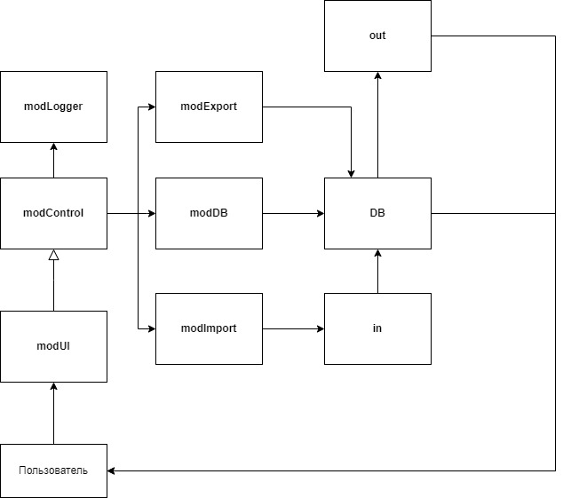

# **Задача.**
## Создать телефонный справочник с возможностью импорта и экспорта данных в нескольких форматах.

## **Архитектура**

- modControl - главный модуль программы
- modDB - модуль для работы с базой данных: получение всез данных или одного контакта, запись нового контакта, очиска телефонной книги
- modExport - модуль для работы с экспортом базы данных: в форматах .csv или .html
- modImport - модуль для работы с импортом базы данных: в форматах .csv или .html
- modLogger - модуль для журнала работы с программой: запись времени и типа действия 
- modUI - модуль взаимодействия с пользователем (меню)
- log.csv - журнал работы программы
- DB.txt - база данных телефонного справочника
- DB.txt - база данных телефонного справочника
- expCSV.csv и expHTML.html - результаты экспорта данных
- impCSV.csv и impHTML.html - файлы для импорта данных

